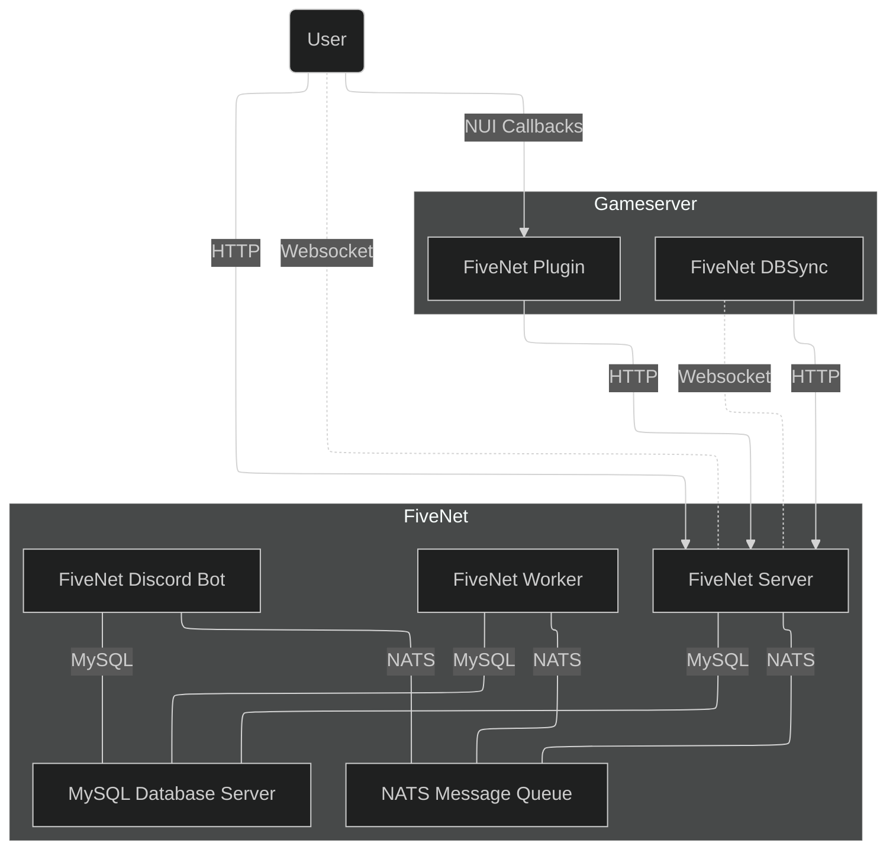

This page describes the components of FiveNet and how they interact with each other.

## Overview

::mermaid

::

## FiveNet

- **Server**
    - Serves the API, frontend resources (e.g., CSS, JS, map tiles).
- **Worker**
    - Runs "background" tasks, e.g., dispatch center assignment, expiration, cleanup, etc., and more.
- **DBSync**
    - Used to sync your gameserver's data (characters, vehicles, etc.) to the FiveNet server.
    - User locations, events and other activitiies are not synced via the DBSync, that is what the plugin is used for.
- **Discord Bot**
    - To sync user group and job user information.

## Services

- **NATS Message Queue**
    - Communication between FiveNet components, user notifications and more.
- **MySQL database server**

## Gameserver / Plugin

- Gameserver plugin to send activities and events that happen on the gameserver to the FiveNet server (e.g., job demotions/promotions).
- Additionally, if enabled, sends the player locations to the FiveNet server for the livemap.
