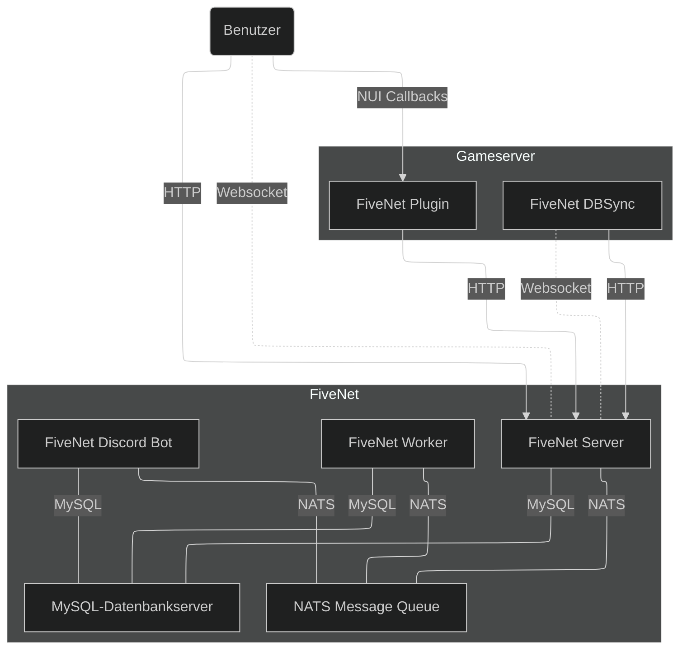

Diese Seite beschreibt die Komponenten von FiveNet und wie sie miteinander interagieren.

## Übersicht

::mermaid

::

## FiveNet

- **Server**
    - Dient der Bereitstellung der API, Frontend-Ressourcen (z.B. CSS, JS, Kartendaten).
- **Worker**
    - Führt "Hintergrund"-Aufgaben aus, z.B. Zuweisung in der Einsatzzentrale, Ablauf, Bereinigung usw.
- **DBSync**
    - Wird verwendet, um die Daten Ihres Gameservers (Charaktere, Fahrzeuge usw.) mit dem FiveNet-Server zu synchronisieren.
    - Benutzerstandorte, Ereignisse und andere Aktivitäten werden nicht über DBSync synchronisiert, dafür wird das Plugin verwendet.
- **Discord Bot**
    - Zum Synchronisieren von Benutzergruppen- und Jobbenutzerinformationen.

## Dienste

- **NATS Message Queue**
    - Kommunikation zwischen FiveNet-Komponenten, Benachrichtigungen für Benutzer und mehr.
- **MySQL-Datenbankserver**

## Gameserver / Plugin

- Gameserver-Plugin, um Aktivitäten und Ereignisse, die auf dem Gameserver stattfinden, an den FiveNet-Server zu senden (z.B. Job-Degradierungen/Beförderungen).
- Zusätzlich, falls aktiviert, werden die Spielerstandorte an den FiveNet-Server für die Livemap gesendet.
