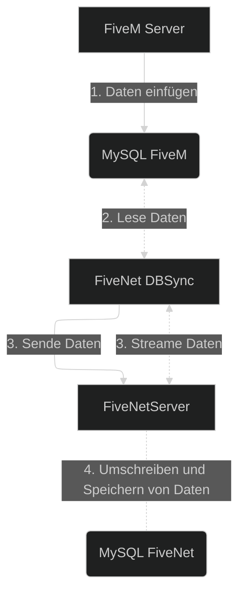

DBSync wird verwendet, um Charakter-/Spieler-, Fahrzeug- und andere Daten von der Gameserver-Datenbank mit Ihrer FiveNet-Instanz zu synchronisieren.

Gründe, warum Sie DBSync verwenden sollten:

- Sie verwenden **nicht** das FiveM ESX-Framework.
- Um FiveNet im "Standalone"-Modus unabhängig vom Gameserver zu betreiben.
- Sie können den Datenbankserver des Gameservers nicht für FiveNet erreichbar machen (z.B. eingeschränktes Gameserver-Hosting, Firewalls, die Sie nicht ändern können).
- Sie nutzen das FiveNet-Cloud-Angebot.

## Voraussetzungen

FiveNet's DBSync (`fivenet` CLI) ist verfügbar für:

- Windows (nur die neuesten Versionen von Windows Server und Windows 11 werden unterstützt)
    - `amd64` - Typische Windows-Server laufen auf dieser Architektur.
- Linux
    - `amd64` - Typische Linux-Server laufen auf dieser Architektur.
    - `arm64` - Die neuere 64-Bit-ARM-Architektur, die häufig im Raspberry Pi 4 und anderen ARM-basierten Servern zu finden ist.

### Datenbank

Der DBSync kann derzeit **nur mit MySQL-Datenbanken** sprechen.
Wenn Ihr Gameserver z.B. MongoDB verwendet, können Sie den DBSync aktuell nicht nutzen. Sollte das ein Bedarf sein, können Sie gerne ein Ticket im GitHub Projekt erstellen.

## Architecture

::mermaid

::

## Installation

Um DBSync zu installieren, führen Sie die folgenden Schritte aus:

1. Laden Sie die neueste Version der `fivenet`-Binary oder -Exe aus [dem offiziellen FiveNet-Repository](https://github.com/fivenet-app/fivenet/releases) herunter und entpacken Sie sie.
    Beispiel unter Linux mit `curl`-Befehl:
    ```bash
    curl -LO https://github.com/fivenet-app/fivenet/releases/latest/download/fivenet-linux-amd64.tar.gz
    tar -xzf fivenet-linux-amd64.tar.gz
    ```
2. Erstellen Sie ein eigenes Verzeichnis für die DBSync-Binary bzw. -Exe und die Konfigurationsdateien.
    - Zum Beispiel unter Linux: `mkdir -p /opt/fivenet/dbsync`
    - Unter Windows können Sie z.B. ein Verzeichnis wie `C:\Program Files\FiveNet\DBSync` anlegen.
3. Verschieben Sie die entpackte `fivenet`-Binary bzw. -Exe, `config.example.yaml` und `dbsync.example.yaml` in das erstellte Verzeichnis für FiveNet DBSync.
     - Stellen Sie sicher, dass die Binary ausführbar ist, z.B. unter Linux: `chmod +x fivenet`.
4. Optional: Fügen Sie die `fivenet`-Binary zu Ihrem System-`PATH` hinzu, um sie von überall ausführen zu können.
    - Unter Linux:
      - Fügen Sie das Verzeichnis, das die `fivenet`-Binary enthält, zu Ihrem `PATH` hinzu, indem Sie die folgende Zeile zu Ihrer `~/.bashrc` oder `~/.zshrc` hinzufügen:
        ```bash
        export PATH="/opt/fivenet/dbsync:$PATH"
        ```
      - Laden Sie die Änderungen neu: `source ~/.bashrc` oder `source ~/.zshrc`.
    - Unter Windows:
      - Öffnen Sie die Systemeinstellungen und navigieren Sie zu "Umgebungsvariablen".
      - Bearbeiten Sie die Variable `Path` und fügen Sie den Pfad zu Ihrem `fivenet`-Verzeichnis hinzu, z.B. `C:\Program Files\FiveNet\DBSync`.
      - Speichern Sie die Änderungen und starten Sie die Eingabeaufforderung oder PowerShell neu.
5. Benennen Sie die Datei `dbsync.example.yaml` in `dbsync.yaml` um.
    - Unter Linux: `mv dbsync.example.yaml dbsync.yaml`
    - Unter Windows: Rechtsklick auf die Datei, "Umbenennen" auswählen und in `dbsync.yaml` ändern.
6. Bearbeiten Sie die Datei `dbsync.yaml`, um die DBSync-Konfiguration vorzunehmen.
    - Sie können jeden Texteditor verwenden, z.B. `nano`, `vim` oder `gedit` unter Linux, oder Notepad unter Windows.
    - Beispielbefehl unter Linux: `nano dbsync.yaml`
    - Beispielbefehl unter Windows: Öffnen Sie Notepad und dann die Datei `dbsync.yaml`.
    - Folgen Sie dem [Konfigurationsabschnitt](#konfiguration) unten für Details zur Einrichtung.
7. Sie können den DBSync-Prozess jetzt mit dem Befehl `fivenet dbsync` starten.

::callout{color="info" icon="i-mdi-info-slab-circle"}
Sobald der DBSync-Prozess keine Fehler mehr protokolliert, wird empfohlen, DBSync als Dienst auf Ihrem Server einzurichten.
So startet er automatisch beim Booten und kann einfach verwaltet werden.

Sie können dem Abschnitt [Einrichtung als Dienst](#einrichtung-als-dienst) unten folgen (für Linux finden Sie ein Beispiel für eine systemd-Unit im Abschnitt [Ausführung als Systemd-Unit/Service](#ausführung-als-systemd-unitservice)).
::

### Einrichtung als Dienst

Um den DBSync-Prozess dauerhaft laufen zu lassen, empfiehlt es sich, ihn als Dienst auf Ihrem Server einzurichten. So startet er automatisch beim Booten und kann einfach verwaltet werden.

::callout{color="info" icon="i-mdi-info-slab-circle"}
Dies setzt voraus, dass Sie die `fivenet`-Binary installiert und entweder im System-`PATH` oder in einem eigenen Verzeichnis verfügbar haben.
Falls Sie ein eigenes Verzeichnis verwenden, stellen Sie sicher, dass Sie den vollständigen Pfad zur `fivenet`-Binary notieren.
::

1. Öffnen Sie ein Terminal oder eine Eingabeaufforderung.
     - Unter Windows können Sie mit SHIFT + Rechtsklick im Verzeichnis der `fivenet`-Binary "PowerShell-Fenster hier öffnen" oder "Eingabeaufforderung hier öffnen" auswählen.
2. Navigieren Sie in das Verzeichnis, das die `fivenet`-Binary enthält.
     - Unter Linux: `cd /pfad/zu/fivenet/verzeichnis`
     - Unter Windows: `cd C:\pfad\zu\fivenet\verzeichnis`
3. Folgen Sie den Anweisungen unten, um den DBSync-Dienst zu installieren, zu starten, zu stoppen oder zu deinstallieren.

#### Dienst installieren

Um DBSync als Dienst zu installieren, führen Sie folgenden Befehl aus:

- Unter Linux:
  ```bash
  sudo fivenet dbsync install
```

- Unter Windows:
  ```powershell
  fivenet dbsync install
  ```

Sie können den DBSync-Dienst nun mit den nächsten Befehlen verwalten.

#### Dienst starten / stoppen

Um den DBSync-Dienst zu starten oder zu stoppen, verwenden Sie folgende Befehle:

- Unter Linux:
  ```bash
  sudo fivenet dbsync start
  sudo fivenet dbsync stop
  # oder
  sudo systemctl start fivenet-dbsync
  sudo systemctl stop fivenet-dbsync
  ```

- Unter Windows:
  ```powershell
  fivenet dbsync start
  fivenet dbsync stop
  # oder
  Start-Service fivenet-dbsync
  Stop-Service fivenet-dbsync
  ```

#### Dienst deinstallieren

Um den DBSync-Dienst zu deinstallieren, führen Sie folgenden Befehl aus:

- Unter Linux:
  ```bash
  sudo fivenet dbsync uninstall
  ```

- Unter Windows:
  ```powershell
  fivenet dbsync uninstall
  ```

## Konfiguration

Die Konfiguration von DBSync erfolgt in der Datei `dbsync.yaml`. Nachfolgend finden Sie einen Überblick über die Konfigurationsabschnitte.

### Zielkonfiguration

Der Abschnitt `destination:` ist der Ort, an dem Sie die URL zu Ihrer FiveNet-Instanz konfigurieren müssen. Beispiel:

```yaml
destination:
  # Host + Port zu Ihrer FiveNet-Instanz (erfordert HTTPS/gültige TLS-Zertifikate, es sei denn, `insecure` ist auf `true` gesetzt)
  url: "fivenet.example.com"
  token: "IHR_SYNC_API_TOKEN"
  # TLS-Überprüfung deaktivieren (nicht empfohlen)
  insecure: false
  # Synchronisierungsintervall kann auch pro Tabelle im Abschnitt `tables:` angegeben werden
  syncInterval: 5s
```

### Quellkonfiguration

Der Abschnitt `source:` enthält die Datenbankverbindungsdetails Ihrer Gameserver-Datenbank. Beispiel:

```yaml
# Änderungen an der Quelle erfordern einen Neustart des DBSync
source:
  # Details unter https://github.com/go-sql-driver/mysql#dsn-data-source-name
  # Beachten Sie, dass der Parameter `parseTime` immer auf true gesetzt wird
  dsn: "DB_USER:DB_PASS@tcp(DB_HOST:DB_PORT)/DB_NAME?collation=utf8mb4_unicode_ci&loc=Europe%2FBerlin"
```

### Persistieren des Synchronisierungsstatus

Der DBSync-Prozess speichert den "Synchronisierungsstatus" standardmäßig in einer Datei namens `dbsync.state.yaml`. Diese Datei wird verwendet, um den zuletzt synchronisierten Datenstand zu verfolgen. Stellen Sie sicher, dass diese Datei beibehalten wird, um unnötiges erneutes Synchronisieren aller Daten zu vermeiden.

Um loszulegen, stellen Sie sicher, dass Sie die Synchronisierung aktiviert und ein Synchronisierungs-API-Token in der `config.yaml`-Datei von FiveNet konfiguriert haben.

Der Abschnitt [tables:](#table-queries) wird verwendet, um die Abfragen für die Tabellen zu konfigurieren, die Sie mit FiveNet synchronisieren möchten.
Bitte sehen Sie sich die Beispiele unten für die ESX- und QBCore-Frameworks an.

Sollten Sie ein anderes Framework verwenden, müssen Sie die Abfragen entsprechend anpassen.

### Datenbankbenutzer für die Quelle

Der Benutzer benötigt nur Lesezugriff auf die Datenbank des Gameservers. Beispielabfragen, um einen separaten Benutzer zu erstellen und Lesezugriff auf die Datenbank zu gewähren (stellen Sie sicher, dass Sie den Benutzernamen und das Passwort in `CREATE USER` und den Datenbanknamen des Gameservers in der `GRANT`-Anweisung ersetzen):

```sql
CREATE USER 'fivenet_dbsync'@'localhost' IDENTIFIED BY 'IHR_DBSYNC_BENUTZER_PASSWORT';
GRANT SELECT ON `ihre_gameserver_db`.* TO 'fivenet_dbsync'@'localhost';
```

### Tabellenabfragen

Die Abfragen für die Tabellen müssen die Spalten im Format zurückgeben, das pro Tabelle angegeben ist, z.B. um Benutzerinformationen zurückzugeben, muss das Format `user.COLUMN` sein (z.B. `user.id`, `user.firstname`, `user.lastname`).

Ein wichtiger Punkt ist, dass es besonders wichtig ist, ein konsistentes `id`- und `identifier`-Feld für die Benutzer/Charaktere zurückzugeben.
Das `id`-Feld wird verwendet, um den Benutzer in der Datenbank zu identifizieren, und das `identifier`-Feld wird verwendet, um den Benutzer in FiveNet zu identifizieren.
Zusätzlich wird es verwendet, um mehrere Benutzer/Chars an ein Konto zu "binden", z.B. `char1:LICENSE` und `char2:LICENSE`, wobei das Konto nur die `LICENSE` gesetzt hat.

::callout{color="info" icon="i-mdi-info-slab-circle"}
Wenn Sie ein Job-Framework verwenden, das separate Jobs für Off-Duty-Jobs verwendet (z.B. `off_police`), können Sie sich den Abschnitt [Wie behandelt man Off-Duty-Jobs?](#wie-behandelt-man-off-duty-jobs) unten ansehen, um Details zur Handhabung zu erhalten.
::

Beispielkonfigurationen für einige der gängigsten Frameworks finden Sie im Abschnitt [Beispielkonfigurationen](#beispielkonfigurationen) unten.

## Verwendung

Um den DBSync-Prozess auszuführen, verwenden Sie den `fivenet`-Befehl/Binary wie folgt:

```bash
fivenet dbsync
```

::callout
Um alle verfügbaren Optionen und Flags anzuzeigen, können Sie folgenden Befehl ausführen:

```bash
fivenet dbsync --help
```
::

## Beispielkonfigurationen

### ESX-Framework

```yaml
tables:
  # Die Beispielabfragen hier sind für das ESX-Framework
  jobs:
    # Muss die Spalten `job.name`, `job.label` zurückgeben
    enabled: true
    query: |
      SELECT
        `jobs`.`name` AS `job.name`,
        `jobs`.`label` AS `job.label`
      FROM
        `jobs`
      LIMIT $limit
      OFFSET $offset;
  jobGrades:
    # Muss die Spalten `job_grade.job_name`, `job_grade.grade`, `job_grade.label` zurückgeben (mit `WHERE`-Bedingung für den `job_name`)
    enabled: true
    query:
      SELECT
        `job_grades`.`job_name` AS `job_grade.job_name`,
        `job_grades`.`grade` AS `job_grade.grade`,
        `job_grades`.`name` AS `job_grade.name`,
        `job_grades`.`label` AS `job_grade.label`
      FROM
        `job_grades`
      WHERE
        `job_grades.job_name` = $jobName
      LIMIT $limit
      OFFSET $offset;
  licenses:
    # Muss die Spalten `type`, `label` zurückgeben
    enabled: true
    query: |
      SELECT
        `license.type`,
        `license.label`
      FROM
        `licenses`
      LIMIT $limit
      OFFSET $offset;
  users:
    # Muss die Spalten `user.id`, `user.identifier`, `user.group`, `user.firstname`, `user.lastname`, `user.dateofbirth`, `user.job`, `user.job_grade`, `user.sex`, `user.phone_number` zurückgeben
    # Optionale Spalten: `user.height`, `user.visum`, `user.playtime`
    enabled: true
    # Wenn Ihre "players"/"users"-Daten eine Zeitstempel-/Datumsspalte haben, die bei Updates aktualisiert wird,
    # konfigurieren Sie sie hier, damit nach der ersten Synchronisierung nur die geänderten Daten erneut synchronisiert werden.
    #updatedTimeColumn: "last_seen"
    # Die Identifier-Spalte sollte eine intelligente Kombination von Werten sein, wenn ein Multichar-System verwendet wird.
    # z.B. wird empfohlen, ein ESX-ähnliches Identifier-Layout für diesen Fall zu verwenden `charX:LICENSE`
    query: |
      SELECT
        `users`.`id` AS `user.id`,
        `users`.`identifier` AS `user.identifier`,
        `users`.`group` AS `user.group`,
        `users`.`firstname` AS `user.firstname`,
        `users`.`lastname` AS `user.lastname`,
        `users`.`dateofbirth` AS `user.dateofbirth`,
        `users`.`job` AS `user.job`,
        `users`.`job_grade` AS `user.job_grade`,
        `users`.`sex` AS `user.sex`,
        `users`.`phone_number` AS `user.phone_number`,
        `users`.`height` AS `user.height`,
        `users`.`visum` AS `user.visum`,
        `users`.`playtime` AS `user.playtime`
      FROM
        `users`
      $whereCondition
      LIMIT $limit
      OFFSET $offset;
    # Wenn der Nachname nicht von der Abfrage zurückgegeben wird, dann wird probiert den Vornamen in "zwei" Teile zu teilen
    splitName: true
    # Normalisieren des Geburtsdatum-Ausgabeformat, wenn möglich
    # Bitte sehen Sie sich die Go `time`-Pkg-Dokumentation zu möglichen Datumsformat-Layouts an: https://pkg.go.dev/time#Layout
    dateOfBirth:
      formats:
        - "2006-01-02" # 2000-10-18 = YYYY-MM-DD
        - "02/01/2006" # 09/06/1993 = MM/DD/YYYY
        - "02.01.2006" # 01.08.1982 = DD.MM.YYYY
      outputFormat: "02.01.2006" # DD.MM.YYYY
    valueMapping:
      # Dies ermöglicht es, Werte für FiveNet auf andere Werte abzubilden
      # z.B. muss das Geschlecht eines Charakters entweder `m`, `f` oder `d` sein
      sex:
        fallback: 'm'
        values:
          '1': 'f'
  userLicenses:
    # Muss die Spalten `user_license.type`, `user_license.owner` zurückgeben
    enabled: true
    query: |
      SELECT
        `user_licenses`.`type` AS `user_license.type`,
        `user_licenses`.`owner AS `user_license.owner`
      FROM
        `user_licenses`
      WHERE
        `owner` = $identifier
      LIMIT $limit
      OFFSET $offset;
  vehicles:
    # Muss die Spalten `vehicle.owner_id` oder `vehicle.owner_identifier`, `vehicle.plate`, `vehicle.type`, `vehicle.model` zurückgeben
    enabled: true
    query: |
      SELECT
        `owned_vehicles`.`owner` AS `vehicle.owner_identifier`,
        `owned_vehicles`.`plate` AS `vehicle.plate`,
        `owned_vehicles`.`type` AS `vehicle.type`,
        `owned_vehicles`.`model` AS `vehicle.model`
      FROM
        `owned_vehicles`
      LIMIT $limit
      OFFSET $offset;
```

### QBCore-Framework

```yaml
tables:
  jobs:
    # Muss die Spalten `name`, `label` zurückgeben
    enabled: false
    query: |
      SELECT
        `jobs`.`name` AS `job.name`,
        `jobs`.`label` AS `job.label`
      FROM
        `jobs`
      LIMIT $limit
      OFFSET $offset;
  jobGrades:
    # Muss die Spalten `job_name`, `grade`, `label` zurückgeben (mit `WHERE`-Bedingung für den `job_name` (`$jobName`))
    enabled: false
    query: |
      SELECT
        `job_grades`.`job_name` AS `job_grade.job_name`,
        `job_grades`.`grade` AS `job_grade.grade`,
        `job_grades`.`label` AS `job_grade.label`
      FROM
        `job_grades`
      WHERE
        `job_name` = $jobName
      LIMIT $limit
      OFFSET $offset;
  licenses:
    # Muss die Spalten `type`, `label` zurückgeben
    enabled: false
    query: |
      SELECT
        `licenses`.`type` AS `license.type`,
        `licenses`.`label` AS `license.label`
      FROM
        `licenses`
      LIMIT $limit
      OFFSET $offset;
  users:
    # Muss die Spalten `id`, `identifier`, `group`, `firstname`, `lastname`, `dateofbirth`, `job`, `job_grade`, `sex`, `phone_number` zurückgeben
    # Optionale `height`, `visum`, `playtime`-Spalten
    enabled: false
    # Wenn Ihre "players"/"users"-Daten eine Zeitstempel-/Datumsspalte haben, die bei Updates aktualisiert wird,
    # konfigurieren Sie sie hier, damit nach der ersten Synchronisierung nur die geänderten Daten erneut synchronisiert werden.
    #updatedTimeColumn: "last_seen"
    # Die Identifier-Spalte sollte eine intelligente Kombination von Werten sein, wenn ein Multichar-System verwendet wird.
    # z.B. wird empfohlen, ein ESX-ähnliches Identifier-Layout für diesen Fall zu verwenden `charX:LICENSE`
    query: |
      SELECT
        `players`.`id` AS `user.id`,
        CONCAT(`players`.`cid`, ':', `players`.`citizenid`) AS `user.identifier`,
        'user' AS `user.group`,
        JSON_UNQUOTE(JSON_EXTRACT(`players`.`charinfo`, '$.firstname')) AS `user.firstname`,
        JSON_UNQUOTE(JSON_EXTRACT(`players`.`charinfo`, '$.lastname')) AS `user.lastname`,
        JSON_UNQUOTE(JSON_EXTRACT(`players`.`charinfo`, '$.birthdate')) AS `user.dateofbirth`,
        JSON_UNQUOTE(JSON_EXTRACT(`players`.`charinfo`, '$.height')) AS `user.height`,
        JSON_UNQUOTE(JSON_EXTRACT(`players`.`job`, '$.name')) AS `user.job`,
        JSON_UNQUOTE(JSON_EXTRACT(`players`.`job`, '$.grade.level')) AS `user.job_grade`,
        JSON_UNQUOTE(JSON_EXTRACT(`players`.`charinfo`, '$.gender')) AS `user.sex`,
        JSON_UNQUOTE(JSON_EXTRACT(`players`.`charinfo`, '$.phone`)) AS `user.phone_number`
      FROM
        `players`
      $whereCondition
      LIMIT $limit
      OFFSET $offset;
    # Wenn der Nachname nicht von der Abfrage zurückgegeben wird, dann wird probiert den Vornamen in "zwei" Teile zu teilen
    splitName: true
    # Normalisieren des Geburtsdatum-Ausgabeformat, wenn möglich
    # Bitte sehen Sie sich die Go `time`-Pkg-Dokumentation zu möglichen Datumsformat-Layouts an: https://pkg.go.dev/time#Layout
    dateOfBirth:
      formats:
        - "2006-01-02" # 2000-10-18 = YYYY-MM-DD
        - "02/01/2006" # 09/06/1993 = MM/DD/YYYY
        - "02.01.2006" # 01.08.1982 = DD.MM.YYYY
      outputFormat: "02.01.2006" # DD.MM.YYYY
    valueMapping:
    # Dies ermöglicht es, Werte für FiveNet auf andere Werte abzubilden
    # z.B. muss das Geschlecht eines Charakters entweder `m`, `f` oder `d` sein
      sex:
        fallback: 'm'
        values:
          '1': 'f'
  userLicenses:
    # Muss die Spalten `type`, `owner` zurückgeben
    enabled: false
    query: |
      SELECT
        `user_licenses`.`type` AS `user_license.type`,
        `user_licenses`.`owner` AS `user_license.owner`
      FROM
        `user_licenses`
      WHERE
        `owner` = $identifier
      LIMIT $limit
      OFFSET $offset;
  vehicles:
    # Muss die Spalten `owner_id` (DB User ID) oder `owner_identifier`, `plate`, `type`, `model` zurückgeben
    enabled: true
    query: |
      SELECT
        IF(`player_vehicles`.job_vehicle=0, CONCAT(players.cid, ':', players.`citizenid`), NULL) AS `vehicle.owner_identifier`,
        `player_vehicles`.`plate` AS `vehicle.plate`,
        `player_vehicles`.`garage_type` AS `vehicle.type`,
        `player_vehicles`.`vehicle` AS `vehicle.model`,
        IF(`player_vehicles`.`job_vehicle`=1, `player_vehicles`.`citizenid`, NULL) AS `vehicle.job`
      FROM
        `player_vehicles`
        LEFT JOIN `players` ON (`players`.`citizenid` = `player_vehicles`.`citizenid`)
      LIMIT $limit
      OFFSET $offset;
```

## Ausführung als Systemd-Unit/Service

::callout
Bevor Sie DBSync als Dienst einrichten, stellen Sie sicher, dass Sie über grundlegende Kenntnisse in der Linux-Systemadministration verfügen.
::

Es wird empfohlen, DBSync als Service auf Ihrem Server auszuführen. Zum Beispiel können Sie unter Linux eine Systemd-Unit-Datei erstellen:

```ini
[Unit]
Description=FiveNet DBSync Service
After=network.target

[Service]
ExecStart=/path/to/fivenet dbsync
Restart=always
User=fivenet
Group=fivenet

[Install]
WantedBy=multi-user.target
```

Speichern Sie diese Datei als `/etc/systemd/system/fivenet-dbsync.service`, aktivieren und starten Sie dann den Service:

```bash
sudo systemctl enable fivenet-dbsync
sudo systemctl start fivenet-dbsync
```

## Häufige Probleme & Fragen

### Fehlermeldung: `error during sync stream, restarting in a second`

Diese Fehlermeldung weist darauf hin, dass die Verbindung des DBSync zur FiveNet-Instanz geschlossen oder unterbrochen wurde.
Dies ist ein normales Verhalten und kann ignoriert werden, wenn es nur selten auftritt, da DBSync automatisch versucht, die Verbindung wiederherzustellen.

Lang andauernde Verbindungen können durch Firewalls, Load Balancer oder andere Netzwerkgeräte geschlossen werden, was diese Fehlermeldung verursacht.

### Wie behandelt man Off-Duty-Jobs?

Falls Ihr Job-Framework "Off-Duty"-Jobs verwendet (z.B. `off_police`), können Sie dies im Abschnitt `jobs` und `users` der Tabellenabfragen mit den folgenden Konfigurationsoptionen handhaben.

::callout{color="info" icon="i-mdi-info-slab-circle"}
Dieses Feature wird ab FiveNet `v2025.10.0` und höher verfügbar sein.
::

**Beispiel**:

```yaml
tables:
  jobs:
    filters:
      # Beispiel-Filter zum Entfernen ("drop") von Jobs, die mit "off_" beginnen. Um diesen Abschnitt zu aktivieren, entfernen Sie den Kommentar.
      # Dies ist nützlich in Kombination mit den `users:`-Jobfiltern unten, wenn Sie "Off-Duty"-Jobs haben,
      # die in ihren "tatsächlichen" Jobnamen umgeschrieben werden müssen.
      #
      # In diesem Kontext bedeutet "drop", dass der dbsync den Job nicht an FiveNet sendet.
      - pattern: '^off_'
        action: drop
# [...]
  users:
    # Filters allow to modify certain values before they are sent to FiveNet
    filters:
      jobs:
        # Example: `off_police` -> `police`
        - pattern: '^off_'
          # Suchen nach dem Muster und ersetzen (`action: replace`)...
          action: replace
          # mit einem Leeren String (`replacement: ''`)
          replacement: ''
```
