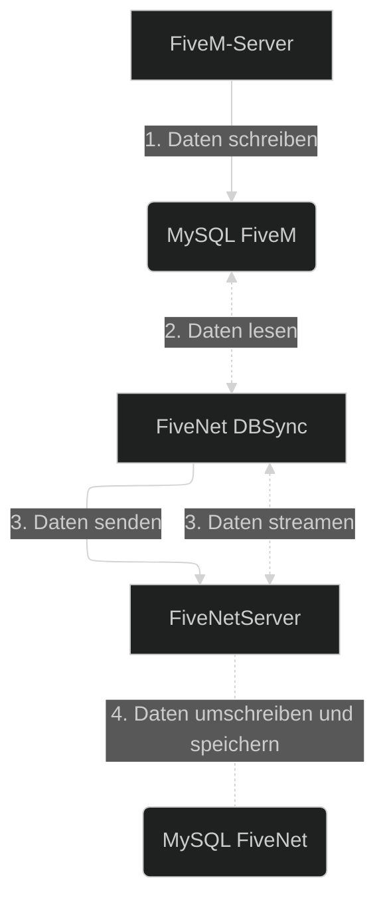

Verwenden Sie DBSync, wenn FiveNet Charaktere, Fahrzeuge und andere Daten aus Ihrer Gameserver-Datenbank übernehmen soll, ohne dass der FiveNet-Server direkten Datenbankzugriff benötigt.

## Warum DBSync erforderlich ist

DBSync ist die Komponente, die Charaktere, Fahrzeuge und andere Gameserver-Daten aus Ihrer Gameserver-Datenbank nach FiveNet überträgt.

Ohne DBSync kann FiveNet seine eigenen Daten nicht mit den von Ihrem Gameserver erzeugten Daten synchron halten.

Dies ist die Standardkonfiguration für FiveNet, einschließlich FiveNet-Cloud-Bereitstellungen.

## Voraussetzungen

FiveNets DBSync (`fivenet` CLI) ist verfügbar für:

- Windows
  - `amd64` - Typische Windows-Server laufen auf dieser Architektur.
- Linux
  - `amd64` - Typische Linux-Server laufen auf dieser Architektur.
  - `arm64` - Die neuere 64-Bit-ARM-Architektur, die häufig in Raspberry Pi 4 und anderen ARM-basierten Servern zu finden ist.

### Datenbank

DBSync unterstützt derzeit nur **MySQL-kompatible Datenbanken**.
Wenn Ihr Gameserver ein anderes Datenbanksystem wie MongoDB verwendet, kann DBSync aktuell nicht genutzt werden.

## Schneller Einrichtungsablauf

1. Installieren Sie die `fivenet`-Binary.
2. Erstellen und bearbeiten Sie `dbsync.yaml`.
3. Aktivieren Sie die FiveNet-Sync-API und konfigurieren Sie mindestens ein Sync-Token in Ihrer zentralen `config.yaml`.
4. Testen Sie `fivenet dbsync` manuell.
5. Sobald die Synchronisierung zuverlässig funktioniert, richten Sie DBSync als Dienst ein.

## Architektur

::mermaid

::

## Installation

::callout{color="info" icon="i-mdi-info-slab-circle"}
Diese Anleitung setzt voraus, dass Sie FiveNet bereits installiert haben und eine funktionierende `config.yaml` für den zentralen FiveNet-Server besitzen.
Falls das noch nicht der Fall ist, folgen Sie bitte zuerst der [Installationsanleitung](../installation/index.md).

Wenn Sie Docker für Ihre FiveNet-Bereitstellung verwenden, können Sie DBSync auch in einem Container ausführen. Siehe dazu den Beispiel-DBSync-Container in der Beispiel-`docker-compose.yml`.
::

Um DBSync zu installieren, führen Sie die folgenden Schritte aus:

1. Laden Sie die neueste Version der `fivenet`-Binary oder -Exe aus [dem offiziellen FiveNet-Repository](https://github.com/fivenet-app/fivenet/releases) herunter und entpacken Sie sie.
   Beispiel unter Linux mit `curl`:
   ```bash
   curl -LO https://github.com/fivenet-app/fivenet/releases/latest/download/fivenet-linux-amd64.tar.gz
   tar -xzf fivenet-linux-amd64.tar.gz
   ```
2. Erstellen Sie ein eigenes Verzeichnis für die DBSync-Binary bzw. -Exe und die Konfigurationsdateien.
   - Zum Beispiel unter Linux: `mkdir -p /opt/fivenet/dbsync`
   - Unter Windows können Sie z. B. ein Verzeichnis wie `C:\Program Files\FiveNet\DBSync` anlegen.
3. Verschieben Sie die entpackte `fivenet`-Binary bzw. -Exe, `config.example.yaml` und `dbsync.example.yaml` in das erstellte Verzeichnis für FiveNet DBSync.
   - Stellen Sie sicher, dass die Binary ausführbar ist, z. B. unter Linux mit `chmod +x fivenet`.
4. Optional: Fügen Sie die `fivenet`-Binary Ihrem System-`PATH` hinzu, damit Sie sie von überall ausführen können.
   - Unter Linux:
     - Fügen Sie das Verzeichnis, das die `fivenet`-Binary enthält, Ihrem `PATH` hinzu, indem Sie die folgende Zeile in Ihre `~/.bashrc` oder `~/.zshrc` aufnehmen:
       ```bash
       export PATH="/opt/fivenet/dbsync:$PATH"
       ```
     - Laden Sie die Änderungen neu: `source ~/.bashrc` oder `source ~/.zshrc`.
   - Unter Windows:
     - Öffnen Sie die Systemeinstellungen und navigieren Sie zu "Umgebungsvariablen".
     - Bearbeiten Sie die Variable `Path` und fügen Sie den Pfad zu Ihrem `fivenet`-Verzeichnis hinzu, z. B. `C:\Program Files\FiveNet\DBSync`.
     - Speichern Sie die Änderungen und starten Sie Eingabeaufforderung oder PowerShell neu.
5. Benennen Sie die Datei `dbsync.example.yaml` in `dbsync.yaml` um.
   - Unter Linux: `mv dbsync.example.yaml dbsync.yaml`
   - Unter Windows: Rechtsklick auf die Datei, "Umbenennen" auswählen und in `dbsync.yaml` ändern.
6. Bearbeiten Sie die Datei `dbsync.yaml`, um DBSync zu konfigurieren.
   - Sie können dazu jeden Texteditor verwenden, z. B. `nano`, `vim` oder `gedit` unter Linux oder Notepad unter Windows.
   - Beispiel unter Linux: `nano dbsync.yaml`
   - Beispiel unter Windows: Öffnen Sie Notepad und dann die Datei `dbsync.yaml`.
   - Folgen Sie dem [Konfigurationsabschnitt](#konfiguration) weiter unten.
7. Stellen Sie sicher, dass die Sync-API in Ihrer zentralen FiveNet-`config.yaml` aktiviert ist und mindestens ein Sync-Token konfiguriert wurde. Siehe [Konfigurationsreferenz](1.config-reference.md#required-options).
8. Sie können DBSync nun mit dem Befehl `fivenet dbsync` ausführen.

::callout{color="info" icon="i-mdi-info-slab-circle"}
Sobald DBSync ohne Fehler läuft, wird empfohlen, den Prozess als Dienst auf Ihrem Server zu betreiben.
So startet er automatisch beim Serverstart und kann einfacher verwaltet werden.

Folgen Sie dazu dem Abschnitt [Als Dienst einrichten](#als-dienst-einrichten). Für Linux finden Sie ein Beispiel im Abschnitt [Als Systemd-Unit oder Dienst ausführen](#als-systemd-unit-oder-dienst-ausführen).
::

### Als Dienst einrichten

Um DBSync dauerhaft auszuführen, empfiehlt es sich, ihn als Dienst auf Ihrem Server einzurichten. So kann er automatisch beim Booten starten und leichter verwaltet werden.

::callout{color="info" icon="i-mdi-info-slab-circle"}
Dies setzt voraus, dass die `fivenet`-Binary installiert ist und sich entweder in Ihrem System-`PATH` oder in einem eigenen Verzeichnis befindet.
Wenn Sie ein eigenes Verzeichnis verwenden, notieren Sie sich den vollständigen Pfad zur `fivenet`-Binary.
::

1. Öffnen Sie ein Terminal oder eine Eingabeaufforderung.
   - Unter Windows können Sie im Verzeichnis der `fivenet`-Binary mit SHIFT + Rechtsklick "PowerShell-Fenster hier öffnen" oder "Eingabeaufforderung hier öffnen" auswählen.
2. Navigieren Sie in das Verzeichnis, das die `fivenet`-Binary enthält.
   - Unter Linux: `cd /pfad/zu/fivenet/verzeichnis`
   - Unter Windows: `cd C:\pfad\zu\fivenet\verzeichnis`
3. Folgen Sie den Anweisungen unten, um den DBSync-Dienst zu installieren, zu starten, zu stoppen oder zu deinstallieren.

#### Dienst installieren

Um DBSync als Dienst zu installieren, führen Sie folgenden Befehl aus:

- Unter Linux:
  ```bash
  sudo fivenet dbsync install
  ```

- Unter Windows:
  ```powershell
  fivenet dbsync install
  ```

Sie können den DBSync-Dienst anschließend mit den folgenden Abschnitten verwalten.

#### Dienst starten / stoppen

Um den DBSync-Dienst zu starten oder zu stoppen, verwenden Sie folgende Befehle:

- Unter Linux:
  ```bash
  sudo fivenet dbsync start
  sudo fivenet dbsync stop
  # oder
  sudo systemctl start fivenet-dbsync
  sudo systemctl stop fivenet-dbsync
  ```

- Unter Windows:
  ```powershell
  fivenet dbsync start
  fivenet dbsync stop
  # oder
  Start-Service fivenet-dbsync
  Stop-Service fivenet-dbsync
  ```

#### Dienst deinstallieren

Um den DBSync-Dienst zu deinstallieren, führen Sie folgenden Befehl aus:

- Unter Linux:
  ```bash
  sudo fivenet dbsync uninstall
  ```

- Unter Windows:
  ```powershell
  fivenet dbsync uninstall
  ```

## Konfiguration

DBSync wird in der Datei `dbsync.yaml` konfiguriert. Die folgenden Abschnitte behandeln die wichtigsten Bereiche.

### Zielkonfiguration

Der Abschnitt `destination:` definiert, wie DBSync sich mit Ihrer FiveNet-Instanz verbindet. Beispiel:

```yaml
destination:
  # Host + Port Ihrer FiveNet-Instanz (erfordert HTTPS/gültige TLS-Zertifikate, außer `insecure` ist auf `true` gesetzt)
  url: "fivenet.example.com"
  token: "IHR_SYNC_API_TOKEN"
  # TLS-Prüfung deaktivieren (nicht empfohlen)
  insecure: false
  # Das Sync-Intervall kann auch pro Tabelle im Abschnitt `tables:` festgelegt werden
  syncInterval: 5s
```

### Quellkonfiguration

Der Abschnitt `source:` enthält die Verbindungsdaten Ihrer Gameserver-Datenbank. Beispiel:

```yaml
# Änderungen an der Quelle erfordern einen Neustart von dbsync
source:
  # Details unter https://github.com/go-sql-driver/mysql#dsn-data-source-name
  # Bitte beachten Sie, dass der Parameter `parseTime` immer auf true gesetzt wird
  dsn: "DB_USER:DB_PASS@tcp(DB_HOST:DB_PORT)/DB_NAME?collation=utf8mb4_unicode_ci&loc=Europe%2FBerlin"
```

### Synchronisierungsstatus speichern

DBSync speichert seinen Synchronisierungsstatus standardmäßig in einer Datei namens `dbsync.state.yaml`. Diese Datei verfolgt den zuletzt synchronisierten Datenstand. Bewahren Sie sie dauerhaft auf, damit nach einem Neustart nicht alles erneut vollständig synchronisiert werden muss.

Bevor Sie DBSync starten, stellen Sie sicher, dass die Sync-API aktiviert ist und ein Sync-API-Token in Ihrer zentralen FiveNet-`config.yaml` konfiguriert wurde.

Der [Tabellenabschnitt](#tabellenabfragen) dient dazu, die Abfragen für die Tabellen zu definieren, die mit FiveNet synchronisiert werden sollen.
Siehe die Beispiele weiter unten für ESX und QBCore.

Wenn Sie ein anderes Framework verwenden, passen Sie die Abfragen entsprechend an.

### Datenbankbenutzer für die Quelle

Der Datenbankbenutzer benötigt nur Lesezugriff auf die Gameserver-Datenbank. Beispielabfragen zum Erstellen eines separaten Benutzers und zum Gewähren von Lesezugriff finden Sie unten. Ersetzen Sie Benutzername, Passwort und Datenbankname vor der Verwendung:

```sql
CREATE USER 'fivenet_dbsync'@'localhost' IDENTIFIED BY 'IHR_DBSYNC_BENUTZER_PASSWORT';
GRANT SELECT ON `ihre_gameserver_db`.* TO 'fivenet_dbsync'@'localhost';
```

### Tabellenabfragen

Die Abfragen für jede Tabelle müssen die von DBSync erwarteten Spalten zurückgeben. Benutzerbezogene Felder müssen beispielsweise als `user.COLUMN` zurückgegeben werden, etwa `user.id`, `user.firstname` und `user.lastname`.

Es ist besonders wichtig, konsistente Werte für `id` und `identifier` von Benutzern bzw. Charakteren zurückzugeben.
Das Feld `id` identifiziert den Benutzer in der Quelldatenbank, während `identifier` von FiveNet verwendet wird, um Charaktere mit Konten zu verknüpfen.
So können auch mehrere Charaktere einem Konto zugeordnet werden, zum Beispiel `char1:LICENSE` und `char2:LICENSE`, die beide zu einem Konto gehören, das nur `LICENSE` speichert.

::callout{color="info" icon="i-mdi-info-slab-circle"}
Wenn Ihr Job-Framework separate Off-Duty-Jobs wie `off_police` verwendet, lesen Sie weiter unten den Abschnitt [Wie man Off-Duty-Jobs behandelt](#wie-man-off-duty-jobs-behandelt).
::

Arbeitsfähige Startpunkte für gängige Frameworks finden Sie im Abschnitt [Beispielkonfigurationen](#beispielkonfigurationen).

## Verwendung

Um DBSync manuell auszuführen, verwenden Sie die `fivenet`-Binary wie folgt:

```bash
fivenet dbsync
```

::callout
Um alle verfügbaren Optionen und Flags anzuzeigen, können Sie folgenden Befehl ausführen:

```bash
fivenet dbsync --help
```
::

## Beispielkonfigurationen

### ESX-Framework

::callout{color="info" icon="i-mdi-info-slab-circle"}
Der folgende `tables`-Konfigurationsausschnitt basiert auf dem ESX-Framework und verwendet die "Simple Query"-Generierung von DBSync, die keine SQL-Abfragen erfordert.

Die meisten Kommentare wurden der Kürze halber weggelassen. Schauen Sie sich die Kommentare in der DBSync-Beispielkonfiguration für zusätzliche Informationen und Details an.
::

```yaml
tables:
  jobs:
    enabled: true
    tableName: "jobs"
    columns:
      name: "name"
      label: "label"
  jobGrades:
    enabled: true
    tableName: "job_grades"
    columns:
      jobName: "job_name"
      grade: "grade"
      name: "name"
      label: "label"
  licenses:
    enabled: true
    tableName: "licenses"
    columns:
      type: "type"
      label: "label"
  users:
    enabled: true
    tableName: "users"
    updatedTimeColumn: "last_seen"
    columns:
      id: "id"
      identifier: "identifier"
      group: "group"
      firstname: "firstname"
      lastname: "lastname"
      dateOfBirth: "dateofbirth"
      sex: "sex"
      height: "height"
      job: "job"
      jobGrade: "job_grade"
      phoneNumber: "phone_number"
    ignoreEmptyNames: true
  userLicenses:
    enabled: true
    tableName: "user_licenses"
    columns:
      type: "type"
      ownerIdentifier: "owner"
  vehicles:
    enabled: true
    tableName: "owned_vehicles"
    updatedTimeColumn: "updated_at"
    columns:
      ownerIdentifier: "owner"
      plate: "plate"
      type: "type"
```

### QBCore-Framework

::callout{color="info" icon="i-mdi-info-slab-circle"}
Die meisten Kommentare wurden der Kürze halber weggelassen. Schauen Sie sich die Kommentare in der DBSync-Beispielkonfiguration für zusätzliche Informationen und Details an.
::

```yaml
tables:
  jobs:
    # Muss die Spalten `name`, `label` zurückgeben
    enabled: false
    query: |
      SELECT
        `jobs`.`name` AS `job.name`,
        `jobs`.`label` AS `job.label`
      FROM
        `jobs`
      LIMIT $limit
      OFFSET $offset;
  jobGrades:
    # Muss die Spalten `job_name`, `grade`, `label` zurückgeben (mit `WHERE`-Bedingung für den `job_name` (`$jobName`))
    enabled: false
    query: |
      SELECT
        `job_grades`.`job_name` AS `job_grade.job_name`,
        `job_grades`.`grade` AS `job_grade.grade`,
        `job_grades`.`label` AS `job_grade.label`
      FROM
        `job_grades`
      WHERE
        `job_name` = $jobName
      LIMIT $limit
      OFFSET $offset;
  licenses:
    # Muss die Spalten `type`, `label` zurückgeben
    enabled: false
    query: |
      SELECT
        `licenses`.`type` AS `license.type`,
        `licenses`.`label` AS `license.label`
      FROM
        `licenses`
      LIMIT $limit
      OFFSET $offset;
  users:
    enabled: false
    #updatedTimeColumn: "last_seen"
    # Die Identifier-Spalte sollte eine sinnvolle Kombination von Werten sein, wenn ein Multichar-System verwendet wird.
    # Beispielsweise ist ein ESX-ähnliches Identifier-Layout in diesem Fall sinnvoll: `charX:LICENSE`
    query: |
      SELECT
        `players`.`id` AS `user.id`,
        CONCAT(`players`.`cid`, ':', `players`.`citizenid`) AS `user.identifier`,
        'user' AS `user.group`,
        JSON_UNQUOTE(JSON_EXTRACT(`players`.`charinfo`, '$.firstname')) AS `user.firstname`,
        JSON_UNQUOTE(JSON_EXTRACT(`players`.`charinfo`, '$.lastname')) AS `user.lastname`,
        JSON_UNQUOTE(JSON_EXTRACT(`players`.`charinfo`, '$.birthdate')) AS `user.dateofbirth`,
        JSON_UNQUOTE(JSON_EXTRACT(`players`.`charinfo`, '$.height')) AS `user.height`,
        JSON_UNQUOTE(JSON_EXTRACT(`players`.`job`, '$.name')) AS `user.job`,
        JSON_UNQUOTE(JSON_EXTRACT(`players`.`job`, '$.grade.level')) AS `user.job_grade`,
        JSON_UNQUOTE(JSON_EXTRACT(`players`.`charinfo`, '$.gender')) AS `user.sex`,
        JSON_UNQUOTE(JSON_EXTRACT(`players`.`charinfo`, '$.phone')) AS `user.phone_number`
      FROM
        `players`
      $whereCondition
      LIMIT $limit
      OFFSET $offset;
    # Wenn kein Nachname zurückgegeben wird, kann der Vorname in zwei Teile aufgeteilt werden
    splitName: true
    # Geburtsdatum wenn möglich in das gewünschte Ausgabeformat umwandeln
    # Mögliche Datumsformat-Layouts finden Sie in der Go-`time`-Dokumentation: https://pkg.go.dev/time#Layout
    dateOfBirth:
      formats:
        - "2006-01-02" # 2000-10-18 = YYYY-MM-DD
        - "02/01/2006" # 09/06/1993 = MM/DD/YYYY
        - "02.01.2006" # 01.08.1982 = DD.MM.YYYY
      outputFormat: "02.01.2006" # DD.MM.YYYY
    valueMapping:
      sex:
        fallback: 'm'
        values:
          '1': 'f'
  userLicenses:
    # Muss die Spalten `type`, `owner` zurückgeben
    enabled: false
    query: |
      SELECT
        `user_licenses`.`type` AS `user_license.type`,
        `user_licenses`.`owner` AS `user_license.owner`
      FROM
        `user_licenses`
      WHERE
        `owner` = $identifier
      LIMIT $limit
      OFFSET $offset;
  vehicles:
    # Muss die Spalten `owner_id` (DB-Benutzer-ID) oder `owner_identifier`, `plate`, `type`, `model` zurückgeben
    enabled: true
    query: |
      SELECT
        IF(`player_vehicles`.job_vehicle=0, CONCAT(players.cid, ':', players.`citizenid`), NULL) AS `vehicle.owner_identifier`,
        `player_vehicles`.`plate` AS `vehicle.plate`,
        `player_vehicles`.`garage_type` AS `vehicle.type`,
        `player_vehicles`.`vehicle` AS `vehicle.model`,
        IF(`player_vehicles`.`job_vehicle`=1, `player_vehicles`.`citizenid`, NULL) AS `vehicle.job`
      FROM
        `player_vehicles`
        LEFT JOIN `players` ON (`players`.`citizenid` = `player_vehicles`.`citizenid`)
      LIMIT $limit
      OFFSET $offset;
```

## Als Systemd-Unit oder Dienst ausführen

::callout
Bevor Sie DBSync als Dienst einrichten, stellen Sie sicher, dass Sie grundlegende Kenntnisse in der Linux-Systemadministration haben.
::

Es wird empfohlen, DBSync als Dienst auf Ihrem Server auszuführen. Unter Linux können Sie zum Beispiel eine systemd-Unit-Datei erstellen:

```ini
[Unit]
Description=FiveNet DBSync Service
After=network.target

[Service]
ExecStart=/path/to/fivenet dbsync
Restart=always
User=fivenet
Group=fivenet

[Install]
WantedBy=multi-user.target
```

Speichern Sie diese Datei als `/etc/systemd/system/fivenet-dbsync.service` und aktivieren und starten Sie den Dienst anschließend:

```bash
sudo systemctl enable fivenet-dbsync
sudo systemctl start fivenet-dbsync
```

## Häufige Probleme und Fragen

### Fehlermeldung: `error during sync stream, restarting in a second`

Diese Meldung bedeutet, dass die DBSync-Verbindung zur FiveNet-Instanz geschlossen oder unterbrochen wurde.
Wenn dies nur gelegentlich passiert, ist es in der Regel unkritisch, da DBSync automatisch versucht, die Verbindung wiederherzustellen.

Lang laufende Verbindungen können durch Firewalls, Load-Balancer oder andere Netzwerkgeräte getrennt werden, was zu dieser Meldung führen kann.

### Wie man Off-Duty-Jobs behandelt

Wenn Ihr Job-Framework separate Off-Duty-Jobs wie `off_police` verwendet, können Sie dies in der `jobs`- und `users`-Tabellenkonfiguration mit Filtern behandeln.

::callout{color="info" icon="i-mdi-info-slab-circle"}
Diese Funktion ist ab FiveNet `v2025.10.0` und höher verfügbar.
::

**Beispiel**:

```yaml
tables:
  jobs:
    filters:
      # Beispiel-Filter, um Jobs zu verwerfen, die mit "off_" beginnen
      # Dies ist nützlich in Kombination mit den `users:`-Jobfiltern unten,
      # wenn "Off-Duty"-Jobs auf ihren eigentlichen Jobnamen zurückgeschrieben werden sollen
      #
      # "drop" bedeutet in diesem Zusammenhang, dass dbsync den Job nicht an FiveNet sendet
      - pattern: '^off_'
        action: drop
# [...]
  users:
    # Filter können bestimmte Werte verändern, bevor sie an FiveNet gesendet werden
    filters:
      jobs:
        # Beispiel: `off_police` -> `police`
        - pattern: '^off_'
          # Das Muster suchen und mit `action: replace` ersetzen ...
          action: replace
          # ... durch einen leeren String (`replacement: ''`)
          replacement: ''
```
