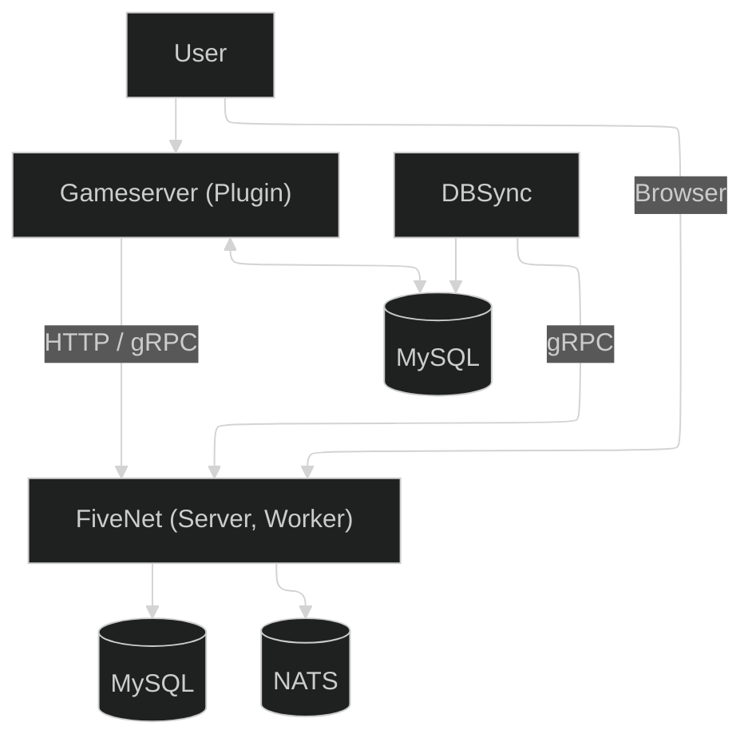
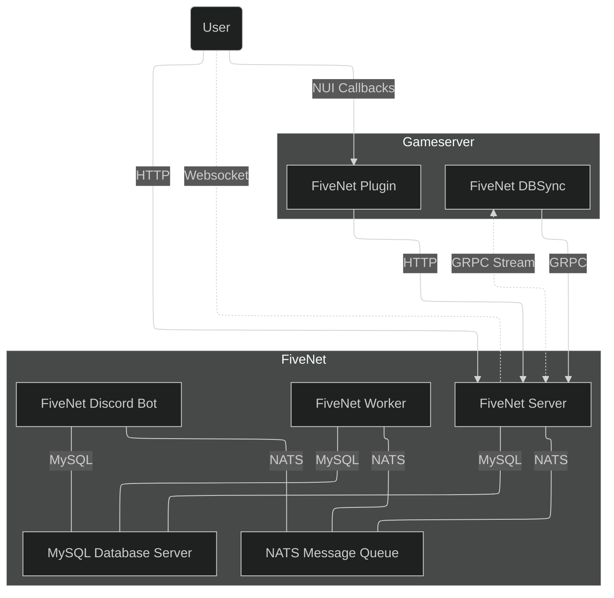

This page gives you a quick overview of the main FiveNet components and how data moves between them.

## Simplified Architecture

::mermaid

::

## Core Components

### FiveNet Server

The server provides the HTTP API and serves the frontend assets, such as JavaScript, CSS, and map tiles.

### FiveNet Worker

The worker handles background jobs such as dispatch assignment, expiration handling, cleanup tasks, and similar asynchronous work.

### FiveNet DBSync

DBSync synchronizes persistent gameserver data, such as characters and vehicles, into FiveNet.

It does **not** handle live activity data like player locations or in-game events. That data is sent by the FiveNet plugin.

### FiveNet Discord Bot

The Discord bot can synchronize user groups and faction job-related user information with Discord servers.

## Supporting Services

### NATS Message Queue

NATS is used for communication between FiveNet components, notifications, and other internal messaging.

### MySQL Database Server

MySQL or MariaDB stores the main FiveNet application data.

## Gameserver Integration

### FiveNet Plugin

The gameserver plugin sends live activities and events from the gameserver to FiveNet, such as promotions, demotions, and other gameplay-related changes.

If enabled, it also sends player locations for the live map.

## Full Architecture

::mermaid

::
