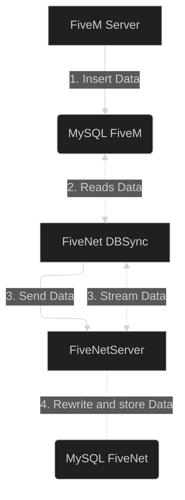

The DBSync is used to sync character/player, vehicles, and other data from your gameserver's database to your FiveNet instance.

Reasons why you would use the DBSync are:

- You are **not** using the FiveM ESX framework.
- To run FiveNet in "standalone" mode independent of the gameserver.
- You would not be able to make the gameserver's database server reachable by FiveNet (e.g., restricted gameserver hosting, firewalls you can't change).
- You are using the FiveNet Cloud offering.

## Requirements

FiveNet's DBSync (`fivenet` cli) is available on:

- Windows (only the latest version of Windows Server and Windows 11 are supported)
    - `amd64` - Your typical Windows server will run on this architecture.
- Linux
    - `amd64` - Your typical Linux server will run on this architecture.
    - `arm64` - The newer 64-bit ARM architecture commonly found in Raspberry Pi 4 and other ARM-based servers.

### Database

The DBSync is only able to connect to **MySQL databases** right now.
In case your gameserver uses, for example, MongoDB, you currently can't use DBSync. If this is a requirement for you, feel free to open an issue in the GitHub project.

## Architecture

::mermaid


## Installation

To install DBSync, follow these steps:

1. Download and extract the latest release of the `fivenet` binary or exe from [the official FiveNet repository](https://github.com/fivenet-app/fivenet/releases).
    Example on Linux using `curl`:
    ```bash
    curl -LO https://github.com/fivenet-app/fivenet/releases/latest/download/fivenet-linux-amd64.tar.gz
    tar -xzf fivenet-linux-amd64.tar.gz
    ```
2. Create a dedicated directory for the DBSync binary or exe and configuration files.
   - For example, on Linux: `mkdir -p /opt/fivenet/dbsync`
   - On Windows, you might create a directory like `C:\Program Files\FiveNet\DBSync`.
3. Move the extracted `fivenet` binary or exe, `config.example.yaml` and `dbsync.example.yaml` to the created directory for FiveNet DBSync.
    - Ensure the binary has executable permissions by running, e.g., on Linux: `chmod +x fivenet`.
4. Optionally: Add the `fivenet` binary to your system `PATH` to make it executable from anywhere.
    - On Linux:
      - Add the directory containing the `fivenet` binary to your `PATH` by appending the following line to your `~/.bashrc` or `~/.zshrc`:
        ```bash
        export PATH="/opt/fivenet/dbsync:$PATH"
        ```
      - Reload the changes: `source ~/.bashrc` or `source ~/.zshrc`.
    - On Windows:
      - Open the System Settings and navigate to "Environment Variables".
      - Edit the `Path` variable and add the path to your `fivenet` directory, e.g., `C:\Program Files\FiveNet\DBSync`.
      - Save the changes and restart your Command Prompt or PowerShell.
5. Rename the `dbsync.example.yaml` file to `dbsync.yaml`.
   - On Linux: `mv dbsync.example.yaml dbsync.yaml`
   - On Windows: Right-click the file, select "Rename", and change it to `dbsync.yaml`.
6. Edit the `dbsync.yaml` file to configure the DBSync.
   - You can use any text editor to edit the file, such as `nano`, `vim`, or `gedit` on Linux, or Notepad on Windows.
   - Example command on Linux: `nano dbsync.yaml`
   - Example command on Windows: Open Notepad and then open the `dbsync.yaml` file.
   - Follow the [configuration section](#configuration) below for details on how to set it up.
7. You can now run the DBSync process using the `fivenet dbsync` command.

::callout{color="info" icon="i-mdi-info-slab-circle"}
Once the DBSync process doesn't log any errors, it is recommended to switch the DBSync to run as a service on your server.
This way, it will automatically start on server boot and can be managed (stopped, restarted) easily.

You can follow the [Setting Up as a Service](#setting-up-as-a-service) section below for details on how to do this (for Linux an example systemd unit can be found in [Running as a Systemd Unit/Service](#running-as-a-systemd-unitservice)).
::

### Setting Up As A Service

To run the DBSync process continuously, it is recommended to set it up as a service on your server. This way, it will automatically start on boot and can be managed easily.

::callout{color="info" icon="i-mdi-info-slab-circle"}
This assumes you have installed the `fivenet` binary and have it available in your system's `PATH` or a dedicated directory.
In case of a dedicated directory make sure to note the full path to the `fivenet` binary.
::

1. Open a terminal or command prompt.
    - On Windows, you can use SHIFT + Right Click in the directory where the `fivenet` binary is located and select "Open PowerShell window here" or "Open command window here".
2. Navigate to the directory that contains the `fivenet` binary.
    - On Linux, you can use `cd /path/to/fivenet/directory`.
    - On Windows, you can use `cd C:\path\to\fivenet\directory`.
3. Follow the instructions below to install, start, stop, or uninstall the DBSync service.

#### Installing the Service

To install the DBSync as a service, run the following command:

- On Linux:
  ```bash
  sudo fivenet dbsync install
  ```

- On Windows:
  ```powershell
  fivenet dbsync install
  ```

You can now manage the DBSync service by following the next sections.

#### Starting / Stopping the Service

To start or stop the DBSync service, use the following commands:

- On Linux:
  ```bash
  sudo fivenet dbsync start
  sudo fivenet dbsync stop
  # or
  sudo systemctl start fivenet-dbsync
  sudo systemctl stop fivenet-dbsync
  ```

- On Windows:
  ```powershell
  fivenet dbsync start
  fivenet dbsync stop
  # or
  Start-Service fivenet-dbsync
  Stop-Service fivenet-dbsync
  ```

#### Uninstalling the Service

To uninstall the DBSync service, run the following command:

- On Linux:
  ```bash
  sudo fivenet dbsync uninstall
  ```

- On Windows:
  ```powershell
  fivenet dbsync uninstall
  ```

## Configuration

The DBSync configuration is done in the `dbsync.yaml` file. Below is an overview of the configuration sections.

### Destination Configuration

The `destination:` section is where you need to configure the URL to your FiveNet instance. Example:

```yaml
destination:
  # Host + port to your FiveNet instance (requires HTTPS/valid TLS certs, unless insecure is set to `true`)
  url: "fivenet.example.com"
  token: "YOUR_SYNC_API_TOKEN"
  # Disable TLS verification (not recommended)
  insecure: false
  # Sync Interval can also be specified per table in the `tables:` section
  syncInterval: 5s
```

### Source Configuration

The `source:` section holds the database connection details of your gameserver database. Example:

```yaml
# Changes to the source require a restart of the dbsync
source:
  # Refer to https://github.com/go-sql-driver/mysql#dsn-data-source-name for details
  # Please note that the `parseTime` parameter is allows set to true
  dsn: "DB_USER:DB_PASS@tcp(DB_HOST:DB_PORT)/DB_NAME?collation=utf8mb4_unicode_ci&loc=Europe%2FBerlin"
```

### Persisting Sync State

The DBSync process stores the "sync state" in a file called `dbsync.state.yaml` by default. This file is used to keep track of the last synced data. Ensure this file is persisted to avoid re-syncing all data unnecessarily.

To get started make sure that you have enabled the sync and configured a sync API token in your FiveNet's `config.yaml` file.

The [tables: section](#table-queries) is used to configure the queries for the tables you want to sync to FiveNet.
Please see the examples below for the ESX and QBCore frameworks.

Should you be using another framework, you will need to adjust the queries accordingly.

### Database User for Source

The user only needs read access to the gameserver's database. Example queries to create a separate user and grant read access to the database (make sure to replace the username and password in the `CREATE USER`, and gameserver database name in the `GRANT` statement):

```sql
CREATE USER 'fivenet_dbsync'@'localhost' IDENTIFIED BY 'YOUR_DBSYNC_USER_PASSWORD';
GRANT SELECT ON `your_gameserver_db`.* TO 'fivenet_dbsync'@'localhost';
```

### Table Queries

The queries for the tables must return the columns in the format specified per table, e.g., to return user info the format must be `user.COLUMN` (e.g., `user.id`, `user.firstname`, `user.lastname`).

An important point to note is that it is especially important to return a consistent `id` and `identifier` field for the users/characters.
The `id` field is used to identify the user in the database, and the `identifier` field is used to identify the user in FiveNet.
In addition to being used to "bind" multiple users/chars to one account, e.g., identifier `char1:LICENSE` and `char2:LICENSE` and the account only has the `LICENSE` set on it.

::callout{color="info" icon="i-mdi-info-slab-circle"}
When using a job framework that uses separate jobs for off-duty jobs (e.g., `off_police`), you can look at the [How to handle Off Duty jobs?](#how-to-handle-off-duty-jobs) section below for details on how to handle this.
::

For example configs for some of the most common frameworks, please see the [Example Configs](#example-configs) section below.

## Usage

To run the DBSync process, use the `fivenet` command/binary as follows:

```bash
fivenet dbsync
```

::callout
To see all available options and flags, you can run:

```bash
fivenet dbsync --help
```
::

## Example Configs

### ESX Framework

```yaml
tables:
  # The example queries here are for the ESX framework
  jobs:
    # Must return `job.name`, `job.label` columns
    enabled: true
    query: |
      SELECT
        `jobs`.`name` AS `job.name`,
        `jobs`.`label` AS `job.label`
      FROM
        `jobs`
      LIMIT $limit
      OFFSET $offset;
  jobGrades:
    # Must return `job_grade.job_name`, `job_grade.grade`, `job_grade.label` columns (with `WHERE` condition for the `job_name`)
    enabled: true
    query:
      SELECT
        `job_grades`.`job_name` AS `job_grade.job_name`,
        `job_grades`.`grade` AS `job_grade.grade`,
        `job_grades`.`name` AS `job_grade.name`,
        `job_grades`.`label` AS `job_grade.label`
      FROM
        `job_grades`
      WHERE
        `job_grades.job_name` = $jobName
      LIMIT $limit
      OFFSET $offset;
  licenses:
    # Must return `type`, `label` columns
    enabled: true
    query: |
      SELECT
        `license.type`,
        `license.label`
      FROM
        `licenses`
      LIMIT $limit
      OFFSET $offset;
  users:
    # Must return `user.id`, `user.identifier`, `user.group`, `user.firstname`, `user.lastname`, `user.dateofbirth`, `user.job`, `user.job_grade`, `user.sex`, `user.phone_number` columns
    # Optional columns: `user.height`, `user.visum`, `user.playtime`
    enabled: true
    # If your "players"/"users" data has a timestamp/datetime column that is updated on update,
    # configure it here so that after the initial sync only the changed data is synced again.
    #updatedTimeColumn: "last_seen"
    # The identifier column should be a smart combination of values when using a multichar system.
    # E.g., it is prefered to use a ESX like identifier layout for that case `charX:LICENSE`
    query: |
      SELECT
        `users`.`id` AS `user.id`,
        `users`.`identifier` AS `user.identifier`,
        `users`.`group` AS `user.group`,
        `users`.`firstname` AS `user.firstname`,
        `users`.`lastname` AS `user.lastname`,
        `users`.`dateofbirth` AS `user.dateofbirth`,
        `users`.`job` AS `user.job`,
        `users`.`job_grade` AS `user.job_grade`,
        `users`.`sex` AS `user.sex`,
        `users`.`phone_number` AS `user.phone_number`,
        `users`.`height` AS `user.height`,
        `users`.`visum` AS `user.visum`,
        `users`.`playtime` AS `user.playtime`
      FROM
        `users`
      $whereCondition
      LIMIT $limit
      OFFSET $offset;
    # If a lastname is not returned by the query, attempt to split the firstname into "two" parts
    splitName: true
    # Normalize date of birth value to the output format if possible
    # Please see the Go `time` pkg documentation on potential date format layouts: https://pkg.go.dev/time#Layout
    dateOfBirth:
      formats:
        - "2006-01-02" # 2000-10-18 = YYYY-MM-DD
        - "02/01/2006" # 09/06/1993 = MM/DD/YYYY
        - "02.01.2006" # 01.08.1982 = DD.MM.YYYY
      outputFormat: "02.01.2006" # DD.MM.YYYY
    valueMapping:
      # This allows to map values to different values for FiveNet
      # E.g., the sex of a char must be either `m`, `f`, or `d`
      sex:
        fallback: 'm'
        values:
          '1': 'f'
  userLicenses:
    # Must return `user_license.type`, `user_license.owner` columns
    enabled: true
    query: |
      SELECT
        `user_licenses`.`type` AS `user_license.type`,
        `user_licenses`.`owner AS `user_license.owner``
      FROM
        `user_licenses`
      WHERE
        `owner` = $identifier
      LIMIT $limit
      OFFSET $offset;
  vehicles:
    # Must return `vehicle.owner_id` or `vehicle.owner_identifier`, `vehicle.plate`, `vehicle.type`, `vehicle.model` columns
    enabled: true
    query: |
      SELECT
        `owned_vehicles`.`owner` AS `vehicle.owner_identifier`,
        `owned_vehicles`.`plate` AS `vehicle.plate`,
        `owned_vehicles`.`type` AS `vehicle.type`,
        `owned_vehicles`.`model` AS `vehicle.model`
      FROM
        `owned_vehicles`
      LIMIT $limit
      OFFSET $offset;
```

### QBCore Framework

```yaml
tables:
  jobs:
    # Must return `name`, `label` columns
    enabled: false
    query: |
      SELECT
        `jobs`.`name` AS `job.name`,
        `jobs`.`label` AS `job.label`
      FROM
        `jobs`
      LIMIT $limit
      OFFSET $offset;
  jobGrades:
    # Must return `job_name`, `grade`, `label` columns (with `WHERE` condition for the `job_name` (`$jobName`))
    enabled: false
    query: |
      SELECT
        `job_grades`.`job_name` AS `job_grade.job_name`,
        `job_grades`.`grade` AS `job_grade.grade`,
        `job_grades`.`label` AS `job_grade.label`
      FROM
        `job_grades`
      WHERE
        `job_name` = $jobName
      LIMIT $limit
      OFFSET $offset;
  licenses:
    # Must return `type`, `label` columns
    enabled: false
    query: |
      SELECT
        `licenses`.`type` AS `license.type`,
        `licenses`.`label` AS `license.label`
      FROM
        `licenses`
      LIMIT $limit
      OFFSET $offset;
  users:
    # Must return `id`, `identifier`, `group`, `firstname`, `lastname`, `dateofbirth`, `job`, `job_grade`, `sex`, `phone_number` columns
    # Optional `height`, `visum`, `playtime` columns
    enabled: false
    #updatedTimeColumn: "last_seen"
    # The identifier column should be a smart combination of values when using a multichar system.
    # E.g., it is prefered to use a ESX like identifier layout for that case `charX:LICENSE`
    query: |
      SELECT
        `players`.`id` AS `user.id`,
        CONCAT(`players`.`cid`, ':', `players`.`citizenid`) AS `user.identifier`,
        'user' AS `user.group`,
        JSON_UNQUOTE(JSON_EXTRACT(`players`.`charinfo`, '$.firstname')) AS `user.firstname`,
        JSON_UNQUOTE(JSON_EXTRACT(`players`.`charinfo`, '$.lastname')) AS `user.lastname`,
        JSON_UNQUOTE(JSON_EXTRACT(`players`.`charinfo`, '$.birthdate')) AS `user.dateofbirth`,
        JSON_UNQUOTE(JSON_EXTRACT(`players`.`charinfo`, '$.height')) AS `user.height`,
        JSON_UNQUOTE(JSON_EXTRACT(`players`.`job`, '$.name')) AS `user.job`,
        JSON_UNQUOTE(JSON_EXTRACT(`players`.`job`, '$.grade.level')) AS `user.job_grade`,
        JSON_UNQUOTE(JSON_EXTRACT(`players`.`charinfo`, '$.gender')) AS `user.sex`,
      FROM
        `players`
      $whereCondition
      LIMIT $limit
      OFFSET $offset;
    # If a lastname is not returned by the query, attempt to split the firstname into "two" parts
    splitName: true
    # Normalize date of birth value to the output format if possible
    # Please see the Go `time` pkg documentation on potential date format layouts: https://pkg.go.dev/time#Layout
    dateOfBirth:
      formats:
        - "2006-01-02" # 2000-10-18 = YYYY-MM-DD
        - "02/01/2006" # 09/06/1993 = MM/DD/YYYY
        - "02.01.2006" # 01.08.1982 = DD.MM.YYYY
      outputFormat: "02.01.2006" # DD.MM.YYYY
    valueMapping:
      sex:
        fallback: 'm'
        values:
          '1': 'f'
  userLicenses:
    # Must return `type`, `owner` columns
    enabled: false
    query: |
      SELECT
        `user_licenses`.`type` AS `user_license.type`,
        `user_licenses`.`owner` AS `user_license.owner`
      FROM
        `user_licenses`
      WHERE
        `owner` = $identifier
      LIMIT $limit
      OFFSET $offset;
  vehicles:
    # Must return `owner_id` (DB User ID) or `owner_identifier`, `plate`, `type`, `model` columns
    enabled: true
    query: |
      SELECT
        IF(`player_vehicles`.job_vehicle=0, CONCAT(players.cid, ':', players.`citizenid`), NULL) AS `vehicle.owner_identifier`,
        `player_vehicles`.`plate` AS `vehicle.plate`,
        `player_vehicles`.`garage_type` AS `vehicle.type`,
        `player_vehicles`.`vehicle` AS `vehicle.model`,
        IF(`player_vehicles`.`job_vehicle`=1, `player_vehicles`.`citizenid`, NULL) AS `vehicle.job`
      FROM
        `player_vehicles`
        LEFT JOIN `players` ON (`players`.`citizenid` = `player_vehicles`.`citizenid`)
      LIMIT $limit
      OFFSET $offset;
```

## Running as a Systemd Unit/Service

::callout
Before proceeding with setting up DBSync as a service, ensure you have a basic understanding of Linux system administration.
::

It is recommended to run DBSync as a service on your server. For example, on Linux, you can create a systemd unit file:

```ini
[Unit]
Description=FiveNet DBSync Service
After=network.target

[Service]
ExecStart=/path/to/fivenet dbsync
Restart=always
User=fivenet
Group=fivenet

[Install]
WantedBy=multi-user.target
```

Save this file as `/etc/systemd/system/fivenet-dbsync.service`, then enable and start the service:

```bash
sudo systemctl enable fivenet-dbsync
sudo systemctl start fivenet-dbsync
```

## Common Issues & Questions

### Error Message: `error during sync stream, restarting in a second`

This error message indicates that the DBSync's connection to the FiveNet instance has been closed or interrupted.
This is normal behavior and can be disregarded if it occurs infrequently, as the DBSync will attempt to reconnect automatically.

Long standing connections can be closed by firewalls, load balancers, or other network devices causing this error message.

### How to handle Off Duty jobs?

In case your job framework uses "off duty" jobs (e.g., `off_police`), you can handle this in the `jobs` and `users` table queries section by using the following config options.

::callout{color="info" icon="i-mdi-info-slab-circle"}
This feature will be available starting with FiveNet `v2025.10.0` and higher.
::

**Example**:

```yaml
tables:
  jobs:
    filters:
      # Example filter to drop jobs starting with "off_", to enable uncomment this section
      # This is useful in combination with the `users:` jobs filters below if you
      # have "off-duty" jobs that need to be rewritten to their "actual" job name
      #
      # Drop in this context means that the dbsync won't send the job to FiveNet
      - pattern: '^off_'
        action: drop
# [...]
  users:
    # Filters allow to modify certain values before they are sent to FiveNet
    filters:
      jobs:
        # Example: `off_police` -> `police`
        - pattern: '^off_'
          # Search for the pattern and replace (`action: replace`) it...
          action: replace
          # with an empty string (`replacement: ''`)
          replacement: ''
```
