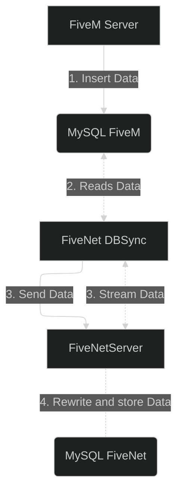

Use DBSync when FiveNet should pull characters, vehicles, and other data from your gameserver database without requiring direct database access from the FiveNet server itself.

## Why DBSync Is Required

DBSync is the component that transfers characters, vehicles, and other gameserver data from your gameserver database into FiveNet.

Without DBSync, FiveNet cannot keep its own data in sync with the data generated by your gameserver.

This is the standard setup for FiveNet, including FiveNet Cloud deployments.

## Requirements

FiveNet's DBSync (`fivenet` cli) is available on:

- Windows (only the latest version of Windows Server and Windows 11 are supported)
    - `amd64` - Your typical Windows server will run on this architecture.
- Linux
    - `amd64` - Your typical Linux server will run on this architecture.
    - `arm64` - The newer 64-bit ARM architecture commonly found in Raspberry Pi 4 and other ARM-based servers.

### Database

DBSync currently supports **MySQL-compatible databases only**.
If your gameserver uses a different database system, such as MongoDB, DBSync cannot be used at the moment.

## Quick Setup Flow

1. Install the `fivenet` binary.
2. Create and edit `dbsync.yaml`.
3. Enable the FiveNet Sync API and configure at least one sync token in your main `config.yaml`.
4. Test `fivenet dbsync` manually.
5. Once the sync works reliably, run it as a service.

## Architecture

::mermaid

```mermaid
---
config:
  theme: dark
  layout: elk
---
flowchart TD
    FiveM["FiveM Server"] -->|1. Insert Data| GameserverDB("MySQL FiveM")
    GameserverDB <-.->|2. Reads Data| DBSync["FiveNet DBSync"]
    DBSync["FiveNet DBSync"] <-..->|3. Stream Data| FiveNetServer
    DBSync["FiveNet DBSync"] --->|3. Send Data| FiveNetServer
    FiveNetServer -.-|4. Rewrite and store Data| FiveNetDB("MySQL FiveNet")
```
::

## Installation

::callout{color="info" icon="i-mdi-info-slab-circle"}
This guide assumes you have already installed FiveNet and have a working `config.yaml` file for the main FiveNet server.
If you haven't done that yet, please follow the [installation guide](../3.installation/index.md) first.

If you are using Docker for your FiveNet deployment, you can also run DBSync in a container. Please refer to the example DBSync container in the example `docker-compose.yml`.
::

To install DBSync, follow these steps:

1. Download and extract the latest release of the `fivenet` binary or exe from [the official FiveNet repository](https://github.com/fivenet-app/fivenet/releases).
    Example on Linux using `curl`:
    ```bash
    curl -LO https://github.com/fivenet-app/fivenet/releases/latest/download/fivenet-linux-amd64.tar.gz
    tar -xzf fivenet-linux-amd64.tar.gz
    ```
2. Create a dedicated directory for the DBSync binary or exe and configuration files.
   - For example, on Linux: `mkdir -p /opt/fivenet/dbsync`
   - On Windows, you might create a directory like `C:\Program Files\FiveNet\DBSync`.
3. Move the extracted `fivenet` binary or exe, `config.example.yaml` and `dbsync.example.yaml` to the created directory for FiveNet DBSync.
    - Ensure the binary has executable permissions by running, e.g., on Linux: `chmod +x fivenet`.
4. Optionally: Add the `fivenet` binary to your system `PATH` to make it executable from anywhere.
    - On Linux:
      - Add the directory containing the `fivenet` binary to your `PATH` by appending the following line to your `~/.bashrc` or `~/.zshrc`:
        ```bash
        export PATH="/opt/fivenet/dbsync:$PATH"
        ```
      - Reload the changes: `source ~/.bashrc` or `source ~/.zshrc`.
    - On Windows:
      - Open the System Settings and navigate to "Environment Variables".
      - Edit the `Path` variable and add the path to your `fivenet` directory, e.g., `C:\Program Files\FiveNet\DBSync`.
      - Save the changes and restart your Command Prompt or PowerShell.
5. Rename the `dbsync.example.yaml` file to `dbsync.yaml`.
   - On Linux: `mv dbsync.example.yaml dbsync.yaml`
   - On Windows: Right-click the file, select "Rename", and change it to `dbsync.yaml`.
6. Edit the `dbsync.yaml` file to configure DBSync.
   - You can use any text editor to edit the file, such as `nano`, `vim`, or `gedit` on Linux, or Notepad on Windows.
   - Example command on Linux: `nano dbsync.yaml`
   - Example command on Windows: Open Notepad and then open the `dbsync.yaml` file.
   - Follow the [configuration section](#configuration) below for details on how to set it up.
7. Make sure the Sync API is enabled in your main FiveNet `config.yaml` and that at least one sync token is configured. See the [Config File Reference](1.config-reference.md#required-options).
8. You can now run the DBSync process using the `fivenet dbsync` command.

::callout{color="info" icon="i-mdi-info-slab-circle"}
Once the DBSync process is running without errors, it is recommended to run DBSync as a service on your server.
This way, it will automatically start on server boot and can be managed (stopped, restarted) easily.

You can follow the [Set Up as a Service](#set-up-as-a-service) section below for details on how to do this. For Linux, an example systemd unit can be found in [Running as a Systemd Unit or Service](#running-as-a-systemd-unit-or-service).
::

### Set Up as a Service

To run DBSync continuously, it is recommended to set it up as a service on your server. This way, it can start automatically on boot and be managed more easily.

::callout{color="info" icon="i-mdi-info-slab-circle"}
This assumes you have installed the `fivenet` binary and that it is available in your system `PATH` or in a dedicated directory.
If you use a dedicated directory, note the full path to the `fivenet` binary.
::

1. Open a terminal or command prompt.
    - On Windows, you can use SHIFT + Right Click in the directory where the `fivenet` binary is located and select "Open PowerShell window here" or "Open command window here".
2. Navigate to the directory that contains the `fivenet` binary.
    - On Linux, you can use `cd /path/to/fivenet/directory`.
    - On Windows, you can use `cd C:\path\to\fivenet\directory`.
3. Follow the instructions below to install, start, stop, or uninstall the DBSync service.

#### Installing the Service

To install the DBSync as a service, run the following command:

- On Linux:
  ```bash
  sudo fivenet dbsync install
  ```

- On Windows:
  ```powershell
  fivenet dbsync install
  ```

You can now manage the DBSync service by following the next sections.

#### Starting / Stopping the Service

To start or stop the DBSync service, use the following commands:

- On Linux:
  ```bash
  sudo fivenet dbsync start
  sudo fivenet dbsync stop
  # or
  sudo systemctl start fivenet-dbsync
  sudo systemctl stop fivenet-dbsync
  ```

- On Windows:
  ```powershell
  fivenet dbsync start
  fivenet dbsync stop
  # or
  Start-Service fivenet-dbsync
  Stop-Service fivenet-dbsync
  ```

#### Uninstalling the Service

To uninstall the DBSync service, run the following command:

- On Linux:
  ```bash
  sudo fivenet dbsync uninstall
  ```

- On Windows:
  ```powershell
  fivenet dbsync uninstall
  ```

## Configuration

DBSync is configured in the `dbsync.yaml` file. The sections below cover the most important parts.

### Destination Configuration

The `destination:` section defines how DBSync connects to your FiveNet instance. Example:

```yaml
destination:
  # Host + port to your FiveNet instance (requires HTTPS/valid TLS certs, unless insecure is set to `true`)
  url: "fivenet.example.com"
  token: "YOUR_SYNC_API_TOKEN"
  # Disable TLS verification (not recommended)
  insecure: false
  # Sync Interval can also be specified per table in the `tables:` section
  syncInterval: 5s
```

### Source Configuration

The `source:` section contains the connection details for your gameserver database. Example:

```yaml
# Changes to the source require a restart of the dbsync
source:
  # Refer to https://github.com/go-sql-driver/mysql#dsn-data-source-name for details
  # Please note that the `parseTime` parameter is always set to true
  dsn: "DB_USER:DB_PASS@tcp(DB_HOST:DB_PORT)/DB_NAME?collation=utf8mb4_unicode_ci&loc=Europe%2FBerlin"
```

### Persisting Sync State

DBSync stores its sync state in a file called `dbsync.state.yaml` by default. This file tracks the last synced data. Persist it so the process does not need to resync everything after a restart.

Before starting DBSync, make sure you have enabled the Sync API and configured a sync API token in your main FiveNet `config.yaml` file.

The [tables section](#table-queries) is used to configure the queries for the tables you want to sync to FiveNet.
See the examples below for ESX and QBCore.

If you are using another framework, adjust the queries accordingly.

### Database User for Source

The database user only needs read access to the gameserver database. Example queries to create a separate user and grant read access are shown below. Replace the username, password, and database name before using them:

```sql
CREATE USER 'fivenet_dbsync'@'localhost' IDENTIFIED BY 'YOUR_DBSYNC_USER_PASSWORD';
GRANT SELECT ON `your_gameserver_db`.* TO 'fivenet_dbsync'@'localhost';
```

### Table Queries

The queries for each table must return the columns in the format expected by DBSync. For example, user-related fields must be returned as `user.COLUMN`, such as `user.id`, `user.firstname`, and `user.lastname`.

It is especially important to return a consistent `id` and `identifier` value for users or characters.
The `id` field identifies the user in the source database, while the `identifier` field is used by FiveNet to associate characters with accounts.
This is also how multiple characters can be bound to one account, for example `char1:LICENSE` and `char2:LICENSE` both matching an account that stores only the `LICENSE`.

::callout{color="info" icon="i-mdi-info-slab-circle"}
When using a job framework that uses separate jobs for off-duty jobs, such as `off_police`, see the [How to Handle Off-Duty Jobs](#how-to-handle-off-duty-jobs) section below.
::

For working starting points for common frameworks, see the [Example Configs](#example-configs) section below.

## Usage

To run DBSync manually, use the `fivenet` binary as follows:

```bash
fivenet dbsync
```

::callout
To see all available options and flags, you can run:

```bash
fivenet dbsync --help
```
::

## Example Configs

### ESX Framework

::callout{color="info" icon="i-mdi-info-slab-circle"}
The following `tables` configuration snippet is based on the ESX framework and uses the DBSync's "Simple Query" generation that requires no SQL-queries.

Most comments have been omited for brevity. Make sure to checkout the comments in the DBSync example config for additional information and details.
::

```yaml
tables:
  jobs:
    enabled: true
    tableName: "jobs"
    columns:
      name: "name"
      label: "label"
  jobGrades:
    enabled: true
    tableName: "job_grades"
    columns:
      jobName: "job_name"
      grade: "grade"
      name: "name"
      label: "label"
  licenses:
    enabled: true
    tableName: "licenses"
    columns:
      type: "type"
      label: "label"
  users:
    enabled: true
    tableName: "users"
    updatedTimeColumn: "last_seen"
    columns:
      id: "id"
      identifier: "identifier"
      group: "group"
      firstname: "firstname"
      lastname: "lastname"
      dateOfBirth: "dateofbirth"
      sex: "sex"
      height: "height"
      job: "job"
      jobGrade: "job_grade"
      phoneNumber: "phone_number"
    ignoreEmptyNames: true
  userLicenses:
    enabled: true
    tableName: "user_licenses"
    columns:
      type: "type"
      ownerIdentifier: "owner"
  vehicles:
    enabled: true
    tableName: "owned_vehicles"
    updatedTimeColumn: "updated_at"
    columns:
      ownerIdentifier: "owner"
      plate: "plate"
      type: "type"
```

### QBCore Framework

::callout{color="info" icon="i-mdi-info-slab-circle"}
Most comments have been omited for brevity. Make sure to checkout the comments in the DBSync example config for additional information and details.
::

```yaml
tables:
  jobs:
    # Must return `name`, `label` columns
    enabled: false
    query: |
      SELECT
        `jobs`.`name` AS `job.name`,
        `jobs`.`label` AS `job.label`
      FROM
        `jobs`
      LIMIT $limit
      OFFSET $offset;
  jobGrades:
    # Must return `job_name`, `grade`, `label` columns (with `WHERE` condition for the `job_name` (`$jobName`))
    enabled: false
    query: |
      SELECT
        `job_grades`.`job_name` AS `job_grade.job_name`,
        `job_grades`.`grade` AS `job_grade.grade`,
        `job_grades`.`label` AS `job_grade.label`
      FROM
        `job_grades`
      WHERE
        `job_name` = $jobName
      LIMIT $limit
      OFFSET $offset;
  licenses:
    # Must return `type`, `label` columns
    enabled: false
    query: |
      SELECT
        `licenses`.`type` AS `license.type`,
        `licenses`.`label` AS `license.label`
      FROM
        `licenses`
      LIMIT $limit
      OFFSET $offset;
  users:
    enabled: false
    #updatedTimeColumn: "last_seen"
    # The identifier column should be a smart combination of values when using a multichar system.
    # E.g., it is prefered to use a ESX like identifier layout for that case `charX:LICENSE`
    query: |
      SELECT
        `players`.`id` AS `user.id`,
        CONCAT(`players`.`cid`, ':', `players`.`citizenid`) AS `user.identifier`,
        'user' AS `user.group`,
        JSON_UNQUOTE(JSON_EXTRACT(`players`.`charinfo`, '$.firstname')) AS `user.firstname`,
        JSON_UNQUOTE(JSON_EXTRACT(`players`.`charinfo`, '$.lastname')) AS `user.lastname`,
        JSON_UNQUOTE(JSON_EXTRACT(`players`.`charinfo`, '$.birthdate')) AS `user.dateofbirth`,
        JSON_UNQUOTE(JSON_EXTRACT(`players`.`charinfo`, '$.height')) AS `user.height`,
        JSON_UNQUOTE(JSON_EXTRACT(`players`.`job`, '$.name')) AS `user.job`,
        JSON_UNQUOTE(JSON_EXTRACT(`players`.`job`, '$.grade.level')) AS `user.job_grade`,
        JSON_UNQUOTE(JSON_EXTRACT(`players`.`charinfo`, '$.gender')) AS `user.sex`,
        JSON_UNQUOTE(JSON_EXTRACT(`players`.`charinfo`, '$.phone')) AS `user.phone_number`
      FROM
        `players`
      $whereCondition
      LIMIT $limit
      OFFSET $offset;
    # If a lastname is not returned by the query, attempt to split the firstname into "two" parts
    splitName: true
    # Normalize date of birth value to the output format if possible
    # Please see the Go `time` pkg documentation on potential date format layouts: https://pkg.go.dev/time#Layout
    dateOfBirth:
      formats:
        - "2006-01-02" # 2000-10-18 = YYYY-MM-DD
        - "02/01/2006" # 09/06/1993 = MM/DD/YYYY
        - "02.01.2006" # 01.08.1982 = DD.MM.YYYY
      outputFormat: "02.01.2006" # DD.MM.YYYY
    valueMapping:
      sex:
        fallback: 'm'
        values:
          '1': 'f'
  userLicenses:
    # Must return `type`, `owner` columns
    enabled: false
    query: |
      SELECT
        `user_licenses`.`type` AS `user_license.type`,
        `user_licenses`.`owner` AS `user_license.owner`
      FROM
        `user_licenses`
      WHERE
        `owner` = $identifier
      LIMIT $limit
      OFFSET $offset;
  vehicles:
    # Must return `owner_id` (DB User ID) or `owner_identifier`, `plate`, `type`, `model` columns
    enabled: true
    query: |
      SELECT
        IF(`player_vehicles`.job_vehicle=0, CONCAT(players.cid, ':', players.`citizenid`), NULL) AS `vehicle.owner_identifier`,
        `player_vehicles`.`plate` AS `vehicle.plate`,
        `player_vehicles`.`garage_type` AS `vehicle.type`,
        `player_vehicles`.`vehicle` AS `vehicle.model`,
        IF(`player_vehicles`.`job_vehicle`=1, `player_vehicles`.`citizenid`, NULL) AS `vehicle.job`
      FROM
        `player_vehicles`
        LEFT JOIN `players` ON (`players`.`citizenid` = `player_vehicles`.`citizenid`)
      LIMIT $limit
      OFFSET $offset;
```

## Running as a Systemd Unit or Service

::callout
Before proceeding with setting up DBSync as a service, ensure you have a basic understanding of Linux system administration.
::

It is recommended to run DBSync as a service on your server. For example, on Linux, you can create a systemd unit file:

```ini
[Unit]
Description=FiveNet DBSync Service
After=network.target

[Service]
ExecStart=/path/to/fivenet dbsync
Restart=always
User=fivenet
Group=fivenet

[Install]
WantedBy=multi-user.target
```

Save this file as `/etc/systemd/system/fivenet-dbsync.service`, then enable and start the service:

```bash
sudo systemctl enable fivenet-dbsync
sudo systemctl start fivenet-dbsync
```

## Common Issues and Questions

### Error Message: `error during sync stream, restarting in a second`

This message indicates that the DBSync connection to the FiveNet instance was closed or interrupted.
If it happens only occasionally, it is usually harmless because DBSync will attempt to reconnect automatically.

Long-running connections can be closed by firewalls, load balancers, or other network devices, which can lead to this message.

### How to Handle Off-Duty Jobs

If your job framework uses separate off-duty jobs, such as `off_police`, you can handle this in the `jobs` and `users` table configuration by using filters.

::callout{color="info" icon="i-mdi-info-slab-circle"}
This feature will be available starting with FiveNet `v2025.10.0` and higher.
::

**Example**:

```yaml
tables:
  jobs:
    filters:
      # Example filter to drop jobs starting with "off_", to enable uncomment this section
      # This is useful in combination with the `users:` jobs filters below if you
      # have "off-duty" jobs that need to be rewritten to their "actual" job name
      #
      # Drop in this context means that the dbsync won't send the job to FiveNet
      - pattern: '^off_'
        action: drop
# [...]
  users:
    # Filters allow to modify certain values before they are sent to FiveNet
    filters:
      jobs:
        # Example: `off_police` -> `police`
        - pattern: '^off_'
          # Search for the pattern and replace (`action: replace`) it...
          action: replace
          # with an empty string (`replacement: ''`)
          replacement: ''
```
