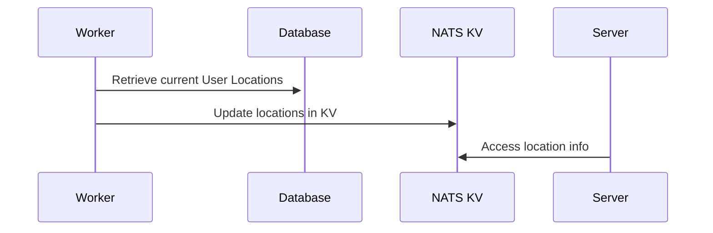

## Current Functionality

- Storing Livemap Marker (for "live" positions)
- Ability to get a single players position.
- Knowing if player is on/off duty.
- Subscribing to new on duty players and off duty/left server players
  - Jobs Timeclock: Could be moved to FiveM-server-side.

## Goals

- Use Nats key value store for sharing the state.

::mermaid

::
