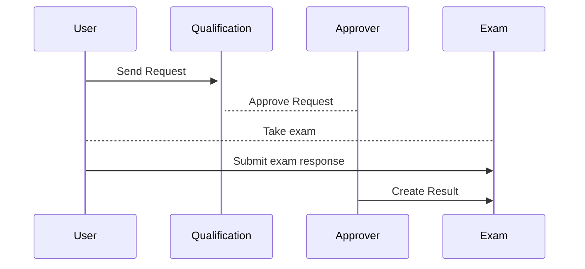
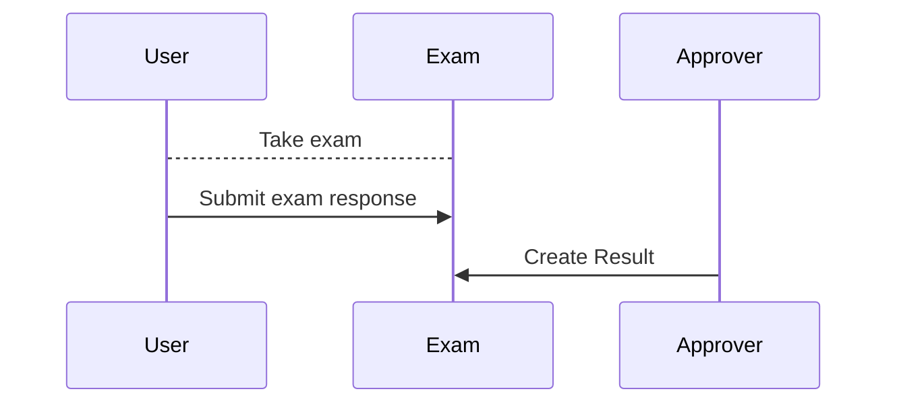

**Status**: Implemented

## What is a Qualifications?

- An access level protected entity with a "public" (as in "anyone can see") facing name and description.
- A training/module that someone has been "granted" or has succcessfully taken the test for.
- A qualification can require certain prerequisites. A prerequisite can be a job rank, other successful qualification.

### What elements are needed?

- Qualification: Holds all basic infos about the qualification.
  - Access: Holds the access levels to the qualification.
  - Requirements: Requirements to be able to take the qualification. -> Don't deny the access to the qualification like access, but are required to send a request or to take the qualification.
- Requests: List of user requests to take the test for the qualification.
- Results: A "mapping" of score of an user test.
- Tests: Test progress of (started) tests from users.
  - Info/Config of the Test: E.g., how many questions need to be right to pass, how much time do they have, etc.
  - Test Questions: Questions for the qualification tests.
  - User Test Answers: Answered questions "waiting for approval" by a "trainer".

### Access Levels

Similarily structured to documents access levels.

- Blocked.
- View.
- Request.
- Take.
- Grade.
- Edit.

## Exams

3 modes for a qualification with an exam:

- Disabled.
- Request needed.
- Enabled.

### Flow - Request needed

::mermaid

::

### Flow - Enabled

::mermaid

::
